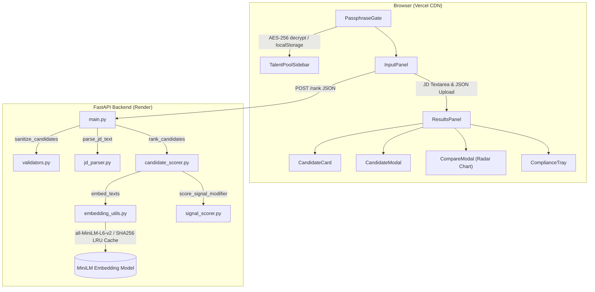
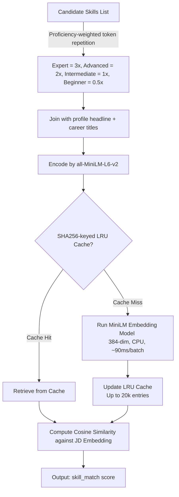

<div align="center">

# 🏆 RRR — Resume Ranker for Recruiters

**AI-powered candidate discovery and ranking platform — RedRob Hackathon 2026**

[](https://rrr-resume-ranker-recruiter-fronten.vercel.app)
[](https://rrr-resume-ranker-backend.onrender.com/health)
[](https://github.com/yashhh-23/Resume-Ranker-for-Recruiters)
[](https://github.com/yashhh-23/Resume-Ranker-for-Recruiters/actions)
[](https://github.com/yashhh-23/Resume-Ranker-for-Recruiters)
[](https://github.com/yashhh-23/Resume-Ranker-for-Recruiters)

> Paste a Job Description → Upload candidates → Get a ranked shortlist with deterministic, explainable scoring in seconds.

**Team Chanakya** · Python 3.11 · FastAPI · React 18 · sentence-transformers · No GPU Required · Zero LLM Hallucination

</div>

---

## 📖 Table of Contents

- [What It Does](#-what-it-does)
- [Live Links](#-live-links)
- [Architecture Overview](#-architecture-overview)
- [Repository Structure](#-repository-structure)
- [Scoring Model](#-scoring-model)
- [Quick Start — Run Locally](#-quick-start--run-locally)
- [Backend Setup](#-backend-fastapi--python)
- [Frontend Setup](#-frontend-react--vite)
- [API Reference](#-api-reference)
- [Judge Walkthrough](#-3-minute-judge-walkthrough)
- [Tech Stack](#-tech-stack)
- [Team](#-team)

---

## 🎯 What It Does

RRR is a full-stack recruitment tool that scores and ranks candidates against a Job Description using a **5-signal weighted scoring engine** backed by local semantic embeddings — no external AI API calls, no GPU required, no LLM generation.

| Input | Output |
|-------|--------|
| **Job Description** (text) | Ranked list of up to 100 candidates (score 0.0 – 1.0) |
| **Candidate JSON array** (up to 1,000) | Per-candidate reasoning string + 5-axis score breakdown |
| *Optional:* salary range, required/preferred skills | Hackathon-compliant `submission.csv` |

### Key Differentiators

| Feature | Detail |
|---------|--------|
| 🔒 **AES-256 Encryption** | Talent pools are encrypted client-side with `crypto-js` and stored locally; they are never sent to any server. |
| 🧠 **Semantic Embeddings** | Uses `all-MiniLM-L6-v2` for deep skill-to-JD matching beyond simple keyword overlap. |
| 📊 **5-Axis Radar Chart** | Allows head-to-head comparison of up to 3 candidates across all scoring dimensions. |
| ⏱️ **Timeline Anomaly Detection** | Automatically flags overlapping or reversed career date ranges. |
| 📥 **One-Click CSV Export** | Generates a CSV fully compliant with the hackathon validation schema (`candidate_id`, `rank`, `score`, `reasoning`). |
| ⚡ **Zero LLM Hallucination** | All reasoning strings are deterministically composed from structured data fields. |

---

## 🔗 Live Links

| Resource | URL |
|----------|-----|
| 🖥️ **Frontend (Vercel)** | [https://rrr-resume-ranker-recruiter-fronten.vercel.app](https://rrr-resume-ranker-recruiter-fronten.vercel.app) |
| ⚡ **Backend API (Render)** | [https://rrr-resume-ranker-backend.onrender.com](https://rrr-resume-ranker-backend.onrender.com) |
| 🩺 **Health Check** | [https://rrr-resume-ranker-backend.onrender.com/health](https://rrr-resume-ranker-backend.onrender.com/health) |
| ⚖️ **Scoring Weights** | [https://rrr-resume-ranker-backend.onrender.com/weights](https://rrr-resume-ranker-backend.onrender.com/weights) |
| 📚 **Swagger UI** | [https://rrr-resume-ranker-backend.onrender.com/docs](https://rrr-resume-ranker-backend.onrender.com/docs) |
| 💻 **Source Code** | [https://github.com/yashhh-23/Resume-Ranker-for-Recruiters](https://github.com/yashhh-23/Resume-Ranker-for-Recruiters) |

> **⚠️ Cold Start Warning:** The backend runs on Render's free tier and may take **15–30 seconds** to wake from sleep. The frontend automatically sends a keep-alive ping on load. If the first `/rank` call is slow, wait a few seconds and retry.

---

## 🏗️ Architecture Overview



---

## 📁 Repository Structure

```
Resume-Ranker-for-Recruiters/
├── README.md                          ← You are here
├── submission_metadata.yaml           ← Hackathon submission manifest
├── .github/
│   └── workflows/
│       └── test-rank.yml              ← CI: pytest on every push to main
│
├── backend/
│   ├── rank.py                        ← CLI entry point (hackathon ranking script)
│   ├── requirements.txt               ← All Python dependencies (pinned)
│   ├── Dockerfile                     ← Container definition for Render
│   ├── app/
│   │   └── main.py                    ← FastAPI app, routes, middleware, rate-limiting
│   ├── ranker/
│   │   ├── __init__.py                ← Public API: parse_jd_text, rank_candidates
│   │   ├── candidate_scorer.py        ← Core 5-signal scoring engine + WEIGHTS dict
│   │   ├── embedding_utils.py         ← sentence-transformers + LRU embedding cache
│   │   ├── jd_parser.py               ← JD text → structured dict (required/preferred skills)
│   │   ├── signal_scorer.py           ← 7-signal modifier + SIGNAL_WEIGHTS
│   │   └── validators.py              ← Candidate sanitisation & safe field defaults
│   └── tests/
│       └── test_ranker.py             ← pytest unit tests (scoring logic)
│
└── frontend/
    ├── package.json                   ← React 18, Vite, Recharts, crypto-js
    ├── vite.config.js
    ├── tailwind.config.js
    └── src/
        ├── App.jsx                    ← Root: state, theme toggle, keep-alive ping
        ├── main.jsx                   ← ReactDOM entry point
        ├── api/
        │   └── rankApi.js             ← fetch wrapper — POST /rank, returns {results, meta}
        ├── components/
        │   ├── PassphraseGate.jsx     ← AES-256 session auth + talent pool unlock
        │   ├── InputPanel.jsx         ← JD textarea, JSON upload, demo loader, JD preview
        │   ├── ResultsPanel.jsx       ← Ranked grid, sort/filter, search
        │   ├── ResultsControls.jsx    ← Sort dropdown, search bar, compare toggle
        │   ├── CandidateCard.jsx      ← Score bar, rank badge, skill chips, select checkbox
        │   ├── CandidateModal.jsx     ← Full profile: timeline, skills, signals, reasoning
        │   ├── CompareModal.jsx       ← Recharts RadarChart + side-by-side table (up to 3)
        │   ├── ComplianceTray.jsx     ← Submission validation + CSV export
        │   ├── TalentPoolSidebar.jsx  ← AES-256 encrypted saved-candidate pools
        │   ├── TalentPoolAddModal.jsx ← Add candidates to encrypted pool
        │   ├── LoadingPhaseDisplay.jsx← 3-phase staged loading UX
        │   └── ScoreBar.jsx           ← Animated score progress bar
        ├── constants/                 ← Demo JD and candidate fixtures
        └── utils/
            ├── scoreUtils.js          ← Score normalisation, ranking, signal_reasoning
            ├── exportCsv.js           ← Hackathon-format CSV builder
            ├── jdUtils.js             ← JD skill extraction helpers
            └── validation.js          ← Submission schema validation
```

---

## 🧠 Scoring Model

Every candidate receives a **final score from 0.0 to 1.0** computed as a weighted sum of five independent components:

### Overall Weights

| Component | Weight | What It Measures |
|-----------|:------:|-----------------|
| `skill_match` | **35%** | Semantic cosine similarity (MiniLM) + required skill coverage ratio + proficiency-weighted endorsement multiplier |
| `career_fit` | **25%** | Title/industry token match × recency decay + years of experience vs JD minimum threshold |
| `signal_modifier` | **15%** | 7-signal composite (see below) |
| `education` | **15%** | Institution tier × degree level × field-of-study compatibility |
| `availability` | **10%** | Open-to-work flag + notice period exponential decay + relocation willingness |

### Signal Modifier Sub-Weights (7 signals)

| Signal | Weight | Source Field |
|--------|:------:|-------------|
| `response_rate` | **40%** | `recruiter_response_rate` |
| `github_score` | 10% | `github_activity_score` (0–100) |
| `interview_completion` | 10% | `interview_completion_rate` |
| `assessment_score` | 10% | `skill_assessment_scores` (mean / 100) |
| `offer_acceptance` | 10% | `offer_acceptance_rate` |
| `profile_completeness` | 10% | `profile_completeness_score` (/ 100) |
| `salary_fit` | 10% | Overlap ratio of candidate salary range vs JD range |

### Skill Embedding Pipeline



> Current weights are always available at: **`GET /weights`**

---

## ⚡ Quick Start — Run Locally

### Prerequisites

- **Python 3.11+**
- **Node.js 18+**
- **Git**

```bash
git clone https://github.com/yashhh-23/Resume-Ranker-for-Recruiters.git
cd Resume-Ranker-for-Recruiters
```

---

## 🐍 Backend (FastAPI + Python)

```bash
cd backend

# 1. Create and activate a virtual environment
python -m venv .venv

# Windows
.venv\Scripts\activate
# macOS / Linux
source .venv/bin/activate

# 2. Install dependencies (~800 MB — includes CPU-only PyTorch)
pip install -r requirements.txt

# 3. Start the API server
python -m uvicorn app.main:app --reload --port 8000
```

The API is now live at **http://localhost:8000**

| Method | Endpoint | Description |
|--------|----------|-------------|
| `GET` | `/` | Service info |
| `GET` | `/health` | Model readiness + uptime |
| `GET` | `/weights` | Live scoring weights |
| `POST` | `/rank` | Rank candidates (JSON body) |
| `GET` | `/docs` | Swagger UI (dev mode only) |

### Run the Hackathon CLI Script

```bash
# Inside backend/ with the venv activated:
python rank.py \
  --candidates ./data/sample_candidates.json \
  --jd ./data/sample_jd.txt \
  --out submission.csv
```

### Run Tests

```bash
cd backend
pytest tests/ -v
```

---

## ⚛️ Frontend (React + Vite)

```bash
cd frontend

# 1. Install dependencies
npm install

# 2. (Optional) Point to local backend — defaults to the Render URL
echo "VITE_API_URL=http://localhost:8000" > .env.local

# 3. Start the dev server
npm run dev
```

Open **http://localhost:5173** in your browser.

### Build for Production

```bash
npm run build    # outputs to frontend/dist/
npm run preview  # preview the production build locally
```

### Environment Variables

| Variable | Default | Description |
|----------|---------|-------------|
| `VITE_API_URL` | `https://rrr-resume-ranker-backend.onrender.com` | Backend API base URL |

---

## 📡 API Reference

### `POST /rank`

Ranks a list of candidates against a job description.

**Rate limit:** 10 requests / minute per IP (configurable via `RANK_RATE_LIMIT` env var)

**Request body:**

```json
{
  "job_description": "We are hiring a Senior Python Engineer with FastAPI and AWS experience...",
  "candidates": [
    {
      "candidate_id": "C001",
      "profile": {
        "headline": "Senior Python Engineer",
        "years_of_experience": 6,
        "current_title": "Backend Engineer",
        "current_company": "Infosys",
        "current_industry": "Technology"
      },
      "skills": [
        { "name": "Python",  "proficiency": "expert",   "endorsements": 15 },
        { "name": "FastAPI", "proficiency": "advanced",  "endorsements": 8  }
      ],
      "education": [
        {
          "degree": "Bachelor of Technology",
          "field_of_study": "Computer Science",
          "institution": "IIT Bombay",
          "tier": "tier_1",
          "end_year": 2018
        }
      ],
      "career_history": [
        {
          "title": "Backend Engineer",
          "company": "Infosys",
          "industry": "Technology",
          "start_date": "2021-06-01",
          "end_date": null,
          "duration_months": 36
        }
      ],
      "redrob_signals": {
        "github_activity_score": 75,
        "recruiter_response_rate": 0.85,
        "interview_completion_rate": 0.90,
        "skill_assessment_scores": { "python": 88, "system_design": 82 },
        "offer_acceptance_rate": 0.70,
        "profile_completeness_score": 92,
        "open_to_work_flag": true,
        "notice_period_days": 30,
        "willing_to_relocate": true,
        "salary_expectation_min": 1800000,
        "salary_expectation_max": 2200000
      }
    }
  ]
}
```

**Response:**

```json
{
  "ranked_candidates": [
    {
      "candidate_id": "C001",
      "rank": 1,
      "score": 0.7842,
      "score_breakdown": {
        "skill_match": 0.8123,
        "career_fit": 0.7654,
        "signal_modifier": 0.7201,
        "education": 0.9000,
        "availability": 0.8100
      },
      "reasoning": "Senior Python Engineer with 6.0 yrs; 2 Python skills matched; top signal skill_match; response rate 0.85.",
      "signal_reasoning": {
        "skill_match": "Semantic similarity 0.81; 2/2 required skills matched",
        "career_fit": "6.0 yrs experience; 1 career roles",
        "signal_modifier": "Response rate 0.85; GitHub 75/100; profile 92%",
        "education": "tier_1 institution; Bachelor in CS",
        "availability": "Open to work; 30-day notice; willing to relocate"
      },
      "compliance_flags": [],
      "is_suspicious": false
    }
  ],
  "skipped_candidates": { "count": 0, "entries": [] },
  "total_candidates": 1,
  "valid_candidates": 1,
  "ranked_count": 1,
  "processing_time_ms": 143,
  "jd_parsed": {
    "required_skills": ["Python", "FastAPI"],
    "preferred_skills": ["AWS"],
    "target_title": "Senior Python Engineer",
    "min_experience_years": 5,
    "seniority_level": "senior",
    "salary_min": 0,
    "salary_max": 0
  },
  "scoring_model": {
    "name": "semantic_hybrid_weighted_v1",
    "description": "5-signal weighted: semantic cosine (MiniLM) + rule-based heuristics",
    "weights": { "skill_match": 0.35, "career_fit": 0.25, "signal_modifier": 0.15, "education": 0.15, "availability": 0.10 },
    "model_id": "sentence-transformers/all-MiniLM-L6-v2"
  }
}
```

**Error responses:**

| Status | Trigger |
|--------|---------|
| `400` | `job_description` is empty or `candidates` array is missing |
| `422` | More than 1,000 candidates submitted |
| `429` | Rate limit exceeded |
| `500` | Internal server error (request ID included for debugging) |


---

## 🎬 3-Minute Judge Walkthrough

* **Step 1 — Open the app**  
  Navigate to [https://rrr-resume-ranker-recruiter-fronten.vercel.app](https://rrr-resume-ranker-recruiter-fronten.vercel.app).  
  Enter passphrase **`hackathon2026`** — this unlocks the AES-256 encrypted talent pool storage.
* **Step 2 — Load demo data**  
  Click **"Load Hackathon Demo"** in the Input Panel. This populates both the JD textarea and the candidate JSON array with a realistic Backend / Data Engineer scenario.
* **Step 3 — Run ranking**  
  Click **"Run Candidate Discovery Matrix"**. Watch the 3-phase loading animation:
  1. *Parsing job requirements…*
  2. *Computing semantic embeddings…*
  3. *Applying signal modifiers…*
* **Step 4 — Explore results**  
  * Click any **candidate card** to open the full profile modal — see the employment timeline (with anomaly flags), proficiency-badged skill gap analysis, and per-dimension signal reasoning sourced from the backend.
  * Use the **sort dropdown** to reorder by score, experience, availability, or skill match.
  * Use the **search bar** to filter by name or headline.
* **Step 5 — Head-to-head comparison**  
  Select 2–3 candidates using the checkbox on each card, then click **"Compare X"**. This opens a `Recharts` radar chart overlaying all selected candidates across the 5 scoring axes, plus a side-by-side dimension table.
* **Step 6 — Export**  
  Click the green **"Export CSV"** button in the Compliance Tray to download `submission.csv` — contains `candidate_id`, `rank`, `score`, and `reasoning` columns, 100% compliant with the hackathon validation schema.
* **Step 7 — Save to talent pool**  
  Click **"Save to Talent Pool"** on any promising candidate to encrypt and persist their profile to `localStorage` for future sessions.

---

## 🛠️ Tech Stack

### Backend

| Package | Version | Purpose |
|---------|---------|---------|
| **Python** | 3.11 | Runtime |
| **FastAPI** | 0.136.3 | REST API framework |
| **Uvicorn** | 0.49.0 | ASGI server |
| **sentence-transformers** | 2.7.0 | `all-MiniLM-L6-v2` semantic embeddings |
| **torch** | 2.12.0 (CPU) | Transformer inference backend |
| **scikit-learn** | 1.9.0 | Cosine similarity utilities |
| **numpy** | 2.4.6 | Embedding vector operations |
| **pydantic** | 2.13.4 | Request / response schema validation |
| **slowapi** | 0.1.9 | Rate limiting (10 req/min on `/rank`) |
| **starlette** | 1.2.1 | Middleware (GZip, CORS, RequestID) |

### Frontend

| Package | Version | Purpose |
|---------|---------|---------|
| **React** | 18.3.1 | UI framework |
| **Vite** | 5.4.0 | Build tool + dev server |
| **Tailwind CSS** | 3.4.10 | Utility-first styling |
| **Recharts** | 3.8.1 | Radar chart for candidate comparison |
| **crypto-js** | 4.2.0 | AES-256 client-side encryption |

### Infrastructure

| Service | Purpose |
|---------|---------|
| **Render** (free tier) | Backend API hosting with auto-deploy |
| **Vercel** | Frontend hosting + global CDN |
| **GitHub Actions** | CI — `pytest tests/ -v` on every push to `main` |

---

## 👤 Team

**Team Chanakya**

| Name | Role |
|------|------|
| **Yash** | ML Engineer · Full-Stack Developer |

**AI Tools Used:** Google Gemini (code optimisation, debugging)

---

## ✅ Declarations

- ✅ Submission specification read and understood
- ✅ All code is original work
- ✅ No collusion with other teams
- ✅ Honeypot check completed
- ✅ Reproduction tested locally — Windows 11, Python 3.11, 8-core CPU, 16 GB RAM, no GPU

---

## 📋 Reproduce Results

```bash
# 1. Clone repository
git clone https://github.com/yashhh-23/Resume-Ranker-for-Recruiters.git
cd Resume-Ranker-for-Recruiters/backend

# 2. Set up environment
python -m venv .venv
.venv\Scripts\activate        # Windows
# source .venv/bin/activate   # macOS / Linux
pip install -r requirements.txt

# 3. Run the ranking script
python rank.py \
  --candidates ./data/sample_candidates.json \
  --jd ./data/sample_jd.txt \
  --out submission.csv

# Output: submission.csv — columns: candidate_id, rank, score, reasoning
```

**Estimated runtime:** ~2 minutes (includes ~90 s model download on first run; cached on all subsequent runs)  
**GPU required:** No  
**Internet required during ranking:** No (after initial model download)

---

<div align="center">

Built with ❤️ by **Team Chanakya** for **RedRob Hackathon 2026**

[🚀 Live Demo](https://rrr-resume-ranker-recruiter-fronten.vercel.app) · [⚡ API Health](https://rrr-resume-ranker-backend.onrender.com/health) · [📚 Swagger](https://rrr-resume-ranker-backend.onrender.com/docs) · [💻 GitHub](https://github.com/yashhh-23/Resume-Ranker-for-Recruiters)

</div>
